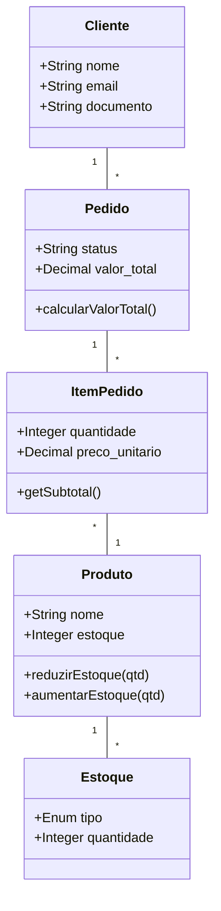
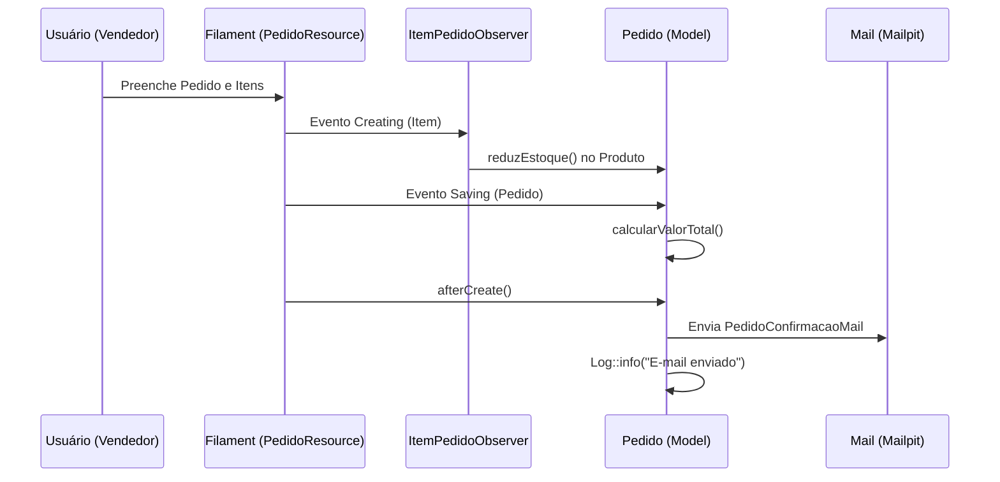

# Documentação do Sistema Confecção TB2

O sistema Confecção TB2 é uma plataforma de gestão administrativa desenvolvida para otimizar os processos internos de uma confecção, abrangendo desde o cadastro de parceiros até o controle fino de estoque e pedidos.

## Sumário

1. [Introdução](#1-introdução)
2. [Situação Problema](#2-situação-problema)
3. [Levantamento de Requisitos](#3-levantamento-de-requisitos)
   - [3.1. Requisitos Funcionais](#31-requisitos-funcionais)
   - [3.2. Requisitos Não Funcionais](#32-requisitos-não-funcionais)
   - [3.3. Regras de Negócio](#33-regras-de-negócio)
   - [3.4. Histórias de Usuários](#34-histórias-de-usuários)
4. [Metodologia e Tecnologias](#4-metodologia-e-tecnologias)
5. [Banco de Dados](#5-banco-de-dados)
   - [5.1. Modelo Lógico (Tabelas e Campos)](#51-modelo-lógico)
   - [5.2. Relacionamentos](#52-relacionamentos)
6. [Arquitetura do Sistema](#6-arquitetura-do-sistema)
   - [6.1. Painel Administrativo (Filament)](#61-painel-administrativo)
   - [6.2. Lógica de Negócio e Observers](#62-lógica-de-negócio)
   - [6.3. Sistema de Notificações](#63-sistema-de-notificações)
7. [Diagramas](#7-diagramas)
   - [7.1. Diagrama de Classe](#71-diagrama-de-classe)
   - [7.2. Diagrama de Sequência](#72-diagrama-de-sequência)
8. [Conclusão](#8-conclusão)
9. [Apêndices](#9-apêndices)

---

## 1. Introdução

O sistema **Confecção TB2** foi desenvolvido para centralizar a operação de uma confecção. Ele permite o gerenciamento completo de clientes, fornecedores, insumos e produtos acabados. O diferencial do sistema reside na automação do cálculo de pedidos, controle rigoroso de estoque via movimentações (Entrada/Saída) e notificações automáticas de confirmação de venda.

- **Nome**: Confecção TB2
- **Tipo**: ERP/Painel Administrativo
- **Stack**: Laravel 11, Filament PHP v3, SQLite/MySQL, Tailwind CSS.

## 2. Situação Problema

Pequenas confecções sofrem com a fragmentação de dados. O controle em planilhas ou papel gera:
- Erros de estoque (venda de produtos sem saldo).
- Dificuldade em calcular o faturamento real e o custo de insumos.
- Falta de histórico de pedidos por cliente.
- Processos manuais de notificação que tomam tempo da equipe.

O sistema resolve esses pontos centralizando a base de dados e automatizando os cálculos e registros de movimentação.

## 3. Levantamento de Requisitos

### 3.1. Requisitos Funcionais

| Código | Requisito Funcional | Descrição |
| --- | --- | --- |
| RF01 | Gestão de Clientes | Cadastro de nome, e-mail, telefone e documento (CPF/CNPJ). |
| RF02 | Gestão de Fornecedores | Registro de fornecedores com CEP e dados de contato. |
| RF03 | Catálogo de Produtos | Cadastro de produtos com referência única e preço de venda. |
| RF04 | Gestão de Insumos | Controle de matérias-primas com unidade de medida e preço de custo. |
| RF05 | Gestão de Pedidos | Criação de pedidos vinculando cliente e múltiplos produtos. |
| RF06 | Cálculo Automático | O sistema soma os itens do pedido e atualiza o `valor_total` automaticamente. |
| RF07 | Controle de Estoque | Registro de entradas e saídas. Saída automática ao finalizar pedido. |
| RF08 | Notificação por E-mail | Envio de confirmação de pedido via `PedidoConfirmacaoMail` após a criação. |
| RF09 | Logs de Notificação | Registro no `storage/logs/laravel.log` de tentativas de envio e simulações. |
| RF10 | Controle de Acesso | Sistema de Roles (Admin, Vendedor, etc.) e Permissions via Spatie. |

### 3.2. Requisitos Não Funcionais

| Código | Requisito Não Funcional | Descrição |
| --- | --- | --- |
| RNF01 | Interface Responsiva | Painel acessível via desktop e dispositivos móveis (Filament). |
| RNF02 | Segurança | Senhas criptografadas e proteção de rotas via middleware de autenticação. |
| RNF03 | Performance | Carregamento otimizado de tabelas com paginação e busca indexada. |
| RNF04 | Padronização | Uso de PSR-12 e arquitetura MVC do Laravel. |
| RNF05 | Testabilidade | Simulação de e-mails via Mailpit em ambiente local. |

### 3.3. Regras de Negócio

| Código | Regra de Negócio | Descrição |
| --- | --- | --- |
| RN01 | Vínculo de Cliente | Não existe pedido órfão; deve haver um `cliente_id` válido. |
| RN02 | Preço Unitário | O item do pedido assume o preço de venda do produto no momento da inserção. |
| RN03 | Estoque Insuficiente | O sistema bloqueia a criação de itens de pedido se o estoque do produto for menor que a quantidade solicitada. |
| RN04 | Movimentação Automática | Ao marcar um pedido como "Finalizado", o sistema gera um registro de saída no estoque e abate do saldo do produto. |
| RN05 | Recálculo de Total | Qualquer alteração (adição, edição ou remoção) em `ItemPedido` dispara o recálculo do `valor_total` do `Pedido`. |
| RN06 | Simulação de Envio | Se o cliente não tiver e-mail, o sistema registra apenas o log da falha, sem interromper o fluxo de criação. |

### 3.4. Histórias de Usuários

- **Como Administrador**, quero gerenciar usuários e permissões para garantir a segurança dos dados.
- **Como Vendedor**, quero cadastrar pedidos e visualizar o status de entrega para informar o cliente.
- **Como Gestor de Estoque**, quero registrar entradas de insumos para manter a produção ativa.
- **Como Cliente**, quero receber um e-mail com o resumo do meu pedido para conferência.

## 4. Metodologia e Tecnologias

O projeto seguiu o modelo **RAD (Rapid Application Development)** utilizando o ecossistema TALL Stack (Tailwind, Alpine.js, Laravel, Livewire), especificamente através do framework **Filament PHP**.

**Tecnologias principais:**
- **Laravel 11**: Core do sistema.
- **Filament v3**: Geração dinâmica de CRUDs e Dashboards.
- **Spatie Laravel Permission**: Gestão de níveis de acesso.
- **Mailpit**: Ferramenta de teste de e-mail local.
- **Observers**: Utilizados para desacoplar a lógica de cálculo e estoque dos Controllers.

## 5. Banco de Dados

### 5.1. Modelo Lógico

| Tabela | Campos | Tipo | Observação |
| --- | --- | --- | --- |
| **clientes** | id, nome, email, telefone, documento | string/text | Dados básicos de contato. |
| **fornecedors** | id, nome, email, telefone, cep, documento | string/text | Registro de parceiros de insumos. |
| **insumos** | id, nome, unidade_medida, preco_custo, estoque | decimal/string | Matéria-prima. |
| **produtos** | id, nome, referencia, preco_venda, estoque | string/decimal/int | Produtos acabados para venda. |
| **pedidos** | id, clientes_id, status, valor_total | bigint/string/decimal | Cabeçalho do pedido. Status: Pendente, Finalizado. |
| **item_pedidos** | id, pedido_id, produto_id, quantidade, preco_unitario | bigint/int/decimal | Linhas do pedido. |
| **estoques** | id, produto_id, tipo, quantidade, observacao | bigint/enum/int | Log de movimentação (Entrada/Saída). |
| **users** | id, name, email, password | string | Usuários do painel. |

### 5.2. Relacionamentos

- **Pedido** `belongsTo` **Cliente** (clientes_id).
- **Pedido** `hasMany` **ItemPedido**.
- **ItemPedido** `belongsTo` **Produto**.
- **Produto** `hasMany` **Estoque** (movimentações).
- **User** `belongsToMany` **Role** (via Spatie).

## 6. Arquitetura do Sistema

### 6.1. Painel Administrativo (Filament)

O sistema utiliza **Resources** do Filament para cada entidade:
- `ClienteResource`: Listagem com filtros e formulário de cadastro.
- `PedidoResource`: Gerenciamento de pedidos com um `Repeater` para `item_pedidos`.
- `ProdutoResource`: Controle de catálogo com badges coloridos para nível de estoque.
- `EstoqueResource`: Registro histórico de todas as movimentações manuais e automáticas.

### 6.2. Lógica de Negócio e Observers

A inteligência do sistema está distribuída em:
- **`ItemPedidoObserver`**:
    - No `creating`: Verifica estoque e reserva a quantidade.
    - No `updating`: Ajusta o saldo do estoque baseado na diferença de quantidade.
    - No `deleting`: Devolve a quantidade ao estoque.
    - No `saved`/`deleted`: Chama o recálculo do valor total do pedido pai.
- **`PedidoObserver`**:
    - No `saving`: Garante que o `valor_total` esteja atualizado antes de persistir no banco.
- **`Pedido Model (booted)`**:
    - Monitora a transição de status para "Finalizado" para disparar a redução física e o log de movimentação.

### 6.3. Sistema de Notificações

Ao criar um pedido (`CreatePedido.php`), o sistema executa a função `afterCreate()`:
1. Carrega as relações de cliente e produtos.
2. Dispara a Mailable `PedidoConfirmacaoMail`.
3. Registra no Log se o e-mail foi enviado com sucesso ou se houve erro (ex: e-mail inválido).

## 7. Diagramas

### 7.1. Diagrama de Classe (Conceitual)



### 7.2. Diagrama de Sequência (Criação de Pedido)



## 8. Conclusão

O sistema Confecção TB2 atende aos requisitos de um ERP moderno para pequenas indústrias. A arquitetura baseada em Observers garante que as regras de estoque sejam aplicadas consistentemente, independente de onde o dado é alterado. A integração com Filament proporciona uma experiência de usuário (UX) superior com baixo esforço de desenvolvimento de UI.

## 9. Apêndices

### Configuração do Mailpit (.env)

```env
MAIL_MAILER=smtp
MAIL_HOST=127.0.0.1
MAIL_PORT=1025
MAIL_FROM_ADDRESS="no-reply@confeccaotb2.test"
MAIL_FROM_NAME="Confecção TB2"
```

### Comandos de Manutenção

- **Migrar Banco**: `php artisan migrate`
- **Criar Admin**: `php artisan make:filament-user`
- **Limpar Cache**: `php artisan optimize:clear`
