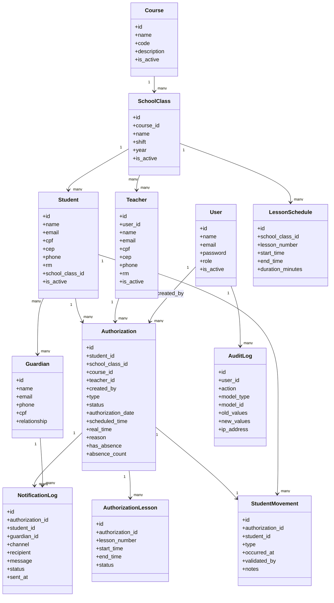
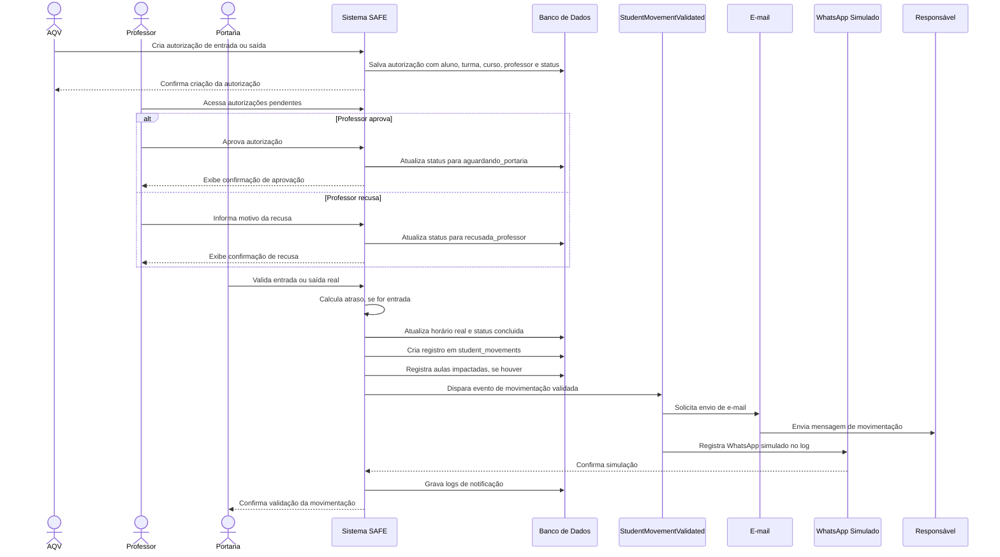

# Documentação do Projeto SAFE

**Projeto:** SAFE - Sistema de Autorização e Fluxo Escolar  
**Tipo de documento:** PRD e documentação técnica para geração de arquivo Word  
**Tecnologias principais:** Laravel, Filament, PHP, Eloquent ORM, Blade/Livewire, MySQL ou PostgreSQL  
**Data-base:** 20/05/2026

> Orientação para a IA que converterá este conteúdo em Word: manter a numeração dos capítulos conforme o sumário solicitado, transformar tabelas em tabelas formais do Word e converter os diagramas em representações visuais quando possível. Este arquivo está estruturado para servir como base textual completa da documentação.

## Sumário

1. Introdução  
2. Situação Problema  
3. Levantamento de Requisitos  
   3.1. Requisitos Funcionais  
   3.2. Requisitos Não Funcionais  
   3.3. Regras de Negócios  
   3.4. Histórias de Usuários  
4. Metodologia  
5. Banco de Dados  
   5.1. Modelo Conceitual  
   5.2. Modelo Lógico  
6. Prototipagem  
7. Diagramas  
   7.1. Diagrama de Classe  
   7.2. Diagrama de Sequência  
8. Conclusão

---

## 1. Introdução

O projeto SAFE, sigla para Sistema de Autorização e Fluxo Escolar, é uma aplicação web administrativa criada para apoiar o controle de entrada e saída de alunos dentro de uma instituição de ensino. Seu objetivo principal é substituir processos manuais, como bilhetes, formulários físicos e comunicações informais, por um fluxo digital registrado, rastreável e validado por diferentes perfis de usuários.

A aplicação foi desenvolvida utilizando Laravel como framework principal e Filament como painel administrativo. Essa escolha permite a construção rápida de cadastros, tabelas, filtros, formulários, dashboards e ações operacionais, mantendo uma base organizada e preparada para evolução futura. O sistema possui módulos para alunos, professores, responsáveis, cursos, turmas, horários de aula, autorizações, movimentações, logs de notificação e auditoria.

No contexto escolar, a circulação de alunos fora do horário padrão exige controle, segurança e comunicação eficiente entre setores. O SAFE atende essa necessidade por meio de um fluxo em que uma autorização é criada, analisada pelo professor e validada pela portaria. Após a validação, o sistema registra a movimentação real do aluno e envia notificações simuladas aos responsáveis por e-mail e WhatsApp simulado.

Além de apoiar a rotina administrativa, o sistema centraliza informações importantes, como histórico de autorizações, horários reais de entrada e saída, faltas por atraso e notificações enviadas. Com isso, a escola passa a ter maior rastreabilidade, padronização e segurança no processo de autorização escolar.

---

## 2. Situação Problema

Em muitas instituições de ensino, a autorização para entrada tardia ou saída antecipada de alunos ainda depende de processos manuais. Esses processos normalmente envolvem papéis, anotações, comunicação verbal entre setores e registros descentralizados. Essa realidade pode gerar falhas operacionais, perda de informações e dificuldade para comprovar quem autorizou ou validou determinada movimentação.

Entre os principais problemas identificados estão:

- Perda ou extravio de autorizações físicas.
- Falta de histórico centralizado sobre entradas, saídas e atrasos.
- Dificuldade de comunicação entre AQV, professores, coordenação e portaria.
- Ausência de rastreabilidade sobre quem criou, aprovou ou validou uma autorização.
- Registro impreciso do horário real de entrada ou saída do aluno.
- Dificuldade para informar responsáveis de forma rápida e padronizada.
- Falta de indicadores consolidados para acompanhamento diário.
- Risco de liberações sem o devido fluxo de validação.

O SAFE foi proposto para resolver esses problemas por meio de um sistema digital com autenticação, perfis de acesso, registro de dados, painel administrativo, regras de negócio e notificações. Dessa forma, o processo deixa de depender apenas de comunicação informal e passa a seguir um fluxo padronizado, auditável e consultável.

---

## 3. Levantamento de Requisitos

O levantamento de requisitos foi baseado na necessidade de controlar o fluxo escolar de alunos, considerando os principais usuários envolvidos no processo: administrador, AQV, professor, portaria e coordenação. Os requisitos foram divididos em funcionais, não funcionais, regras de negócio e histórias de usuários.

### 3.1. Requisitos Funcionais

| Código | Requisito funcional |
|---|---|
| RF01 | O sistema deve permitir autenticação de usuários autorizados. |
| RF02 | O sistema deve controlar o acesso conforme o perfil do usuário. |
| RF03 | O administrador deve poder cadastrar, editar, listar e inativar alunos. |
| RF04 | O administrador deve poder cadastrar, editar, listar e inativar professores. |
| RF05 | O administrador deve poder cadastrar, editar e listar responsáveis. |
| RF06 | O administrador deve poder cadastrar cursos. |
| RF07 | O administrador deve poder cadastrar turmas vinculadas a cursos. |
| RF08 | O sistema deve permitir vincular alunos a turmas. |
| RF09 | O sistema deve permitir vincular professores a turmas. |
| RF10 | O sistema deve permitir cadastrar horários de aula. |
| RF11 | O sistema deve permitir criar autorizações de entrada. |
| RF12 | O sistema deve permitir criar autorizações de saída. |
| RF13 | Ao selecionar um aluno na autorização, o sistema deve preencher turma e curso relacionados. |
| RF14 | O professor deve poder aprovar uma autorização pendente. |
| RF15 | O professor deve poder recusar uma autorização pendente informando motivo. |
| RF16 | A portaria deve poder validar uma autorização aprovada pelo professor. |
| RF17 | O sistema deve registrar o horário real da movimentação validada pela portaria. |
| RF18 | O sistema deve criar um registro de movimentação do aluno após a validação da portaria. |
| RF19 | O sistema deve calcular atraso em autorizações de entrada. |
| RF20 | O sistema deve marcar falta quando o atraso ultrapassar 15 minutos. |
| RF21 | O sistema deve registrar aulas impactadas por atraso. |
| RF22 | O sistema deve disparar evento após validação da movimentação. |
| RF23 | O sistema deve enviar notificação por e-mail aos responsáveis, em ambiente local de testes. |
| RF24 | O sistema deve simular envio de WhatsApp por registro em log. |
| RF25 | O sistema deve gravar logs de notificação enviados ou simulados. |
| RF26 | O dashboard deve exibir indicadores operacionais do dia. |
| RF27 | O sistema deve permitir consultar histórico de autorizações e movimentações. |
| RF28 | O sistema deve registrar informações de auditoria para ações importantes. |

### 3.2. Requisitos Não Funcionais

| Código | Requisito não funcional |
|---|---|
| RNF01 | O sistema deve ser desenvolvido em Laravel. |
| RNF02 | O painel administrativo deve ser desenvolvido com Filament. |
| RNF03 | O sistema deve utilizar PHP 8.3 ou superior. |
| RNF04 | O sistema deve utilizar banco de dados relacional, como MySQL ou PostgreSQL. |
| RNF05 | A estrutura do banco deve ser criada por migrations. |
| RNF06 | O sistema deve utilizar Eloquent ORM para modelagem e relacionamentos. |
| RNF07 | A interface deve ser responsiva e acessível em navegadores modernos. |
| RNF08 | O sistema deve proteger rotas administrativas por autenticação. |
| RNF09 | O sistema deve organizar permissões conforme perfis de usuário. |
| RNF10 | O sistema deve manter histórico e rastreabilidade dos processos principais. |
| RNF11 | O código deve seguir a estrutura padrão do Laravel. |
| RNF12 | O sistema deve estar preparado para futuras integrações externas. |
| RNF13 | O envio real de WhatsApp não faz parte do MVP, devendo ser apenas simulado. |
| RNF14 | O e-mail deve ser testado em ambiente local, preferencialmente com Mailpit. |
| RNF15 | O sistema deve evitar exclusões acidentais de registros críticos. |

### 3.3. Regras de Negócios

| Código | Regra de negócio |
|---|---|
| RN01 | Uma autorização pode ser do tipo `entrada` ou `saida`. |
| RN02 | Toda autorização deve estar vinculada a um aluno, uma turma, um curso e um professor. |
| RN03 | Ao criar uma autorização, o status inicial pode ser `rascunho` ou `aguardando_professor`, conforme operação escolhida. |
| RN04 | Uma autorização aguardando professor só pode ser aprovada ou recusada por usuário com perfil `professor` ou `admin`. |
| RN05 | Quando o professor aprova a autorização, o status muda para `aguardando_portaria`. |
| RN06 | Quando o professor recusa a autorização, o status muda para `recusada_professor` e o motivo deve ser registrado. |
| RN07 | A portaria só pode validar autorizações com status `aguardando_portaria`. |
| RN08 | A validação da portaria deve registrar o horário real da entrada ou saída. |
| RN09 | Após validação da portaria, deve ser criado um registro em `student_movements`. |
| RN10 | Após validação da portaria, deve ser disparado o evento `StudentMovementValidated`. |
| RN11 | Autorizações de entrada devem passar pelo cálculo de atraso. |
| RN12 | Atraso de até 15 minutos não gera falta. |
| RN13 | Atraso superior a 15 minutos gera falta e pode impactar uma ou mais aulas. |
| RN14 | As aulas impactadas devem ser registradas na tabela `authorization_lessons`. |
| RN15 | O sistema considera inicialmente cinco aulas diárias de 45 minutos no período da tarde. |
| RN16 | As notificações aos responsáveis devem ocorrer apenas após a validação da portaria. |
| RN17 | O e-mail deve ser enviado aos responsáveis com endereço cadastrado. |
| RN18 | O WhatsApp deve ser simulado com `Log::info`. |
| RN19 | Cada notificação enviada ou simulada deve gerar um registro em `notification_logs`. |
| RN20 | O administrador possui acesso total aos módulos e ações. |

Os status previstos para uma autorização são:

| Status | Descrição |
|---|---|
| `rascunho` | Autorização criada, mas ainda não enviada para validação. |
| `aguardando_professor` | Autorização aguardando análise do professor. |
| `aprovada_professor` | Status intermediário para indicar aprovação docente, quando utilizado. |
| `recusada_professor` | Autorização recusada pelo professor. |
| `aguardando_portaria` | Autorização aprovada e aguardando validação da portaria. |
| `validada_portaria` | Status intermediário para indicar validação da portaria, quando utilizado. |
| `concluida` | Processo finalizado com movimentação registrada. |
| `cancelada` | Autorização cancelada. |

### 3.4. Histórias de Usuários

| Código | História de usuário |
|---|---|
| HU01 | Como administrador, quero gerenciar usuários e perfis para controlar quem pode acessar o sistema. |
| HU02 | Como administrador, quero cadastrar alunos para que eles possam ser vinculados a turmas e autorizações. |
| HU03 | Como administrador, quero cadastrar professores para que eles possam validar autorizações escolares. |
| HU04 | Como administrador, quero cadastrar responsáveis para que eles sejam notificados sobre movimentações dos alunos. |
| HU05 | Como administrador, quero cadastrar cursos e turmas para organizar a estrutura acadêmica da escola. |
| HU06 | Como AQV, quero criar autorizações de entrada ou saída para formalizar solicitações de movimentação escolar. |
| HU07 | Como AQV, quero que turma e curso sejam preenchidos ao selecionar o aluno para reduzir erros de cadastro. |
| HU08 | Como professor, quero visualizar autorizações pendentes para aprovar ou recusar movimentações relacionadas aos meus alunos. |
| HU09 | Como professor, quero informar o motivo da recusa para registrar a justificativa da decisão. |
| HU10 | Como portaria, quero validar a entrada ou saída real do aluno para confirmar que a movimentação aconteceu. |
| HU11 | Como portaria, quero que o sistema registre automaticamente o horário real da movimentação. |
| HU12 | Como coordenação, quero consultar dashboards e históricos para acompanhar o fluxo diário de alunos. |
| HU13 | Como responsável, quero receber notificação quando o aluno tiver entrada ou saída registrada. |
| HU14 | Como administrador, quero consultar logs de notificação para confirmar se as comunicações foram enviadas ou simuladas. |

---

## 4. Metodologia

O desenvolvimento do SAFE seguiu uma metodologia incremental, baseada em prototipagem funcional. A proposta foi construir um MVP capaz de demonstrar o fluxo principal do processo escolar, priorizando a criação de cadastros, relacionamentos, painel administrativo, ações de validação e registros de histórico.

As etapas adotadas foram:

1. Levantamento do problema e definição dos usuários envolvidos.
2. Identificação dos requisitos funcionais e não funcionais.
3. Modelagem inicial do banco de dados.
4. Criação do projeto Laravel.
5. Instalação e configuração do Filament Admin Panel.
6. Criação das migrations e models Eloquent.
7. Implementação dos relacionamentos entre entidades.
8. Construção dos recursos administrativos do Filament.
9. Implementação do fluxo de autorizações.
10. Implementação das ações de aprovação do professor e validação da portaria.
11. Implementação do serviço de cálculo de atraso e faltas.
12. Implementação do evento de movimentação validada.
13. Implementação dos listeners de e-mail, WhatsApp simulado e log de notificação.
14. Criação de widgets para dashboard.
15. Realização de testes manuais do fluxo principal.

A escolha pelo Laravel se justifica por sua estrutura robusta, suporte a migrations, autenticação, eventos, listeners, filas, e-mails e ORM. O Filament foi escolhido por acelerar a criação de interfaces administrativas completas e padronizadas, permitindo que o foco do MVP permanecesse nas regras de negócio.

---

## 5. Banco de Dados

O banco de dados do SAFE foi modelado de forma relacional, usando migrations do Laravel. A estrutura contempla cadastros acadêmicos, usuários, autorizações, aulas impactadas, movimentações reais, notificações e auditoria.

### 5.1. Modelo Conceitual

No modelo conceitual, as principais entidades do sistema são:

- **Usuário:** representa quem acessa o painel administrativo. Possui perfil, como administrador, AQV, professor, portaria ou coordenação.
- **Aluno:** representa o estudante que pode ter entrada ou saída autorizada.
- **Professor:** representa o docente responsável por aprovar ou recusar autorizações.
- **Responsável:** representa o contato familiar ou legal vinculado ao aluno.
- **Curso:** representa a formação ou eixo acadêmico da instituição.
- **Turma:** representa o agrupamento de alunos dentro de um curso.
- **Horário de Aula:** representa os horários das aulas que podem ser impactadas por atraso.
- **Autorização:** representa a solicitação de entrada ou saída de um aluno.
- **Aula Impactada:** representa o impacto de uma autorização sobre uma aula específica.
- **Movimentação do Aluno:** representa a entrada ou saída efetivamente validada pela portaria.
- **Log de Notificação:** representa o histórico de comunicação enviada ou simulada aos responsáveis.
- **Log de Auditoria:** representa o registro de ações importantes realizadas no sistema.

Relacionamentos conceituais principais:

- Um curso possui muitas turmas.
- Uma turma pertence a um curso.
- Uma turma possui muitos alunos.
- Um aluno pertence a uma turma.
- Um aluno pode ter muitos responsáveis.
- Um responsável pode estar vinculado a muitos alunos.
- Um professor pode estar vinculado a muitas turmas.
- Uma turma pode ter muitos professores.
- Um aluno pode ter muitas autorizações.
- Uma autorização pertence a um aluno, uma turma, um curso e um professor.
- Uma autorização pode gerar uma movimentação real.
- Uma autorização pode gerar várias aulas impactadas.
- Uma autorização pode gerar vários logs de notificação.
- Uma movimentação pertence a uma autorização e a um aluno.

Representação conceitual simplificada:

```text
Curso 1:N Turma
Turma 1:N Aluno
Turma N:N Professor
Aluno N:N Responsável
Aluno 1:N Autorização
Professor 1:N Autorização
Autorização 1:1 Movimentação
Autorização 1:N Aula Impactada
Autorização 1:N Log de Notificação
Usuário 1:N Autorizações criadas
Usuário 1:N Validações realizadas
```

### 5.2. Modelo Lógico

#### Tabela `users`

| Campo | Tipo | Observação |
|---|---|---|
| id | bigint | Chave primária |
| name | string | Nome do usuário |
| email | string | E-mail único |
| email_verified_at | timestamp | Verificação de e-mail |
| password | string | Senha criptografada |
| role | enum | `admin`, `aqv`, `professor`, `portaria`, `coordenacao` |
| is_active | boolean | Indica se o usuário está ativo |
| remember_token | string | Token de sessão |
| created_at | timestamp | Data de criação |
| updated_at | timestamp | Data de atualização |

#### Tabela `courses`

| Campo | Tipo | Observação |
|---|---|---|
| id | bigint | Chave primária |
| name | string | Nome do curso |
| code | string | Código único opcional |
| description | text | Descrição opcional |
| is_active | boolean | Indica se o curso está ativo |
| created_at | timestamp | Data de criação |
| updated_at | timestamp | Data de atualização |

#### Tabela `school_classes`

| Campo | Tipo | Observação |
|---|---|---|
| id | bigint | Chave primária |
| course_id | foreignId | Referência para `courses` |
| name | string | Nome da turma |
| shift | enum | `manha`, `tarde`, `noite` |
| year | integer | Ano letivo |
| is_active | boolean | Indica se a turma está ativa |
| created_at | timestamp | Data de criação |
| updated_at | timestamp | Data de atualização |

#### Tabela `students`

| Campo | Tipo | Observação |
|---|---|---|
| id | bigint | Chave primária |
| name | string | Nome do aluno |
| email | string | E-mail opcional |
| cpf | string | CPF opcional e único |
| cep | string | CEP opcional |
| phone | string | Telefone opcional |
| rm | string | Registro de matrícula único |
| school_class_id | foreignId | Referência para `school_classes` |
| is_active | boolean | Indica se o aluno está ativo |
| created_at | timestamp | Data de criação |
| updated_at | timestamp | Data de atualização |

#### Tabela `teachers`

| Campo | Tipo | Observação |
|---|---|---|
| id | bigint | Chave primária |
| user_id | foreignId | Usuário vinculado, opcional |
| name | string | Nome do professor |
| email | string | E-mail opcional |
| cpf | string | CPF opcional e único |
| cep | string | CEP opcional |
| phone | string | Telefone opcional |
| rm | string | Registro opcional e único |
| is_active | boolean | Indica se o professor está ativo |
| created_at | timestamp | Data de criação |
| updated_at | timestamp | Data de atualização |

#### Tabela `guardians`

| Campo | Tipo | Observação |
|---|---|---|
| id | bigint | Chave primária |
| name | string | Nome do responsável |
| email | string | E-mail opcional |
| phone | string | Telefone opcional |
| cpf | string | CPF opcional e único |
| relationship | string | Grau de parentesco |
| created_at | timestamp | Data de criação |
| updated_at | timestamp | Data de atualização |

#### Tabela `guardian_student`

| Campo | Tipo | Observação |
|---|---|---|
| id | bigint | Chave primária |
| student_id | foreignId | Referência para `students` |
| guardian_id | foreignId | Referência para `guardians` |
| is_primary | boolean | Define responsável principal |
| created_at | timestamp | Data de criação |
| updated_at | timestamp | Data de atualização |

#### Tabela `school_class_teacher`

| Campo | Tipo | Observação |
|---|---|---|
| id | bigint | Chave primária |
| school_class_id | foreignId | Referência para `school_classes` |
| teacher_id | foreignId | Referência para `teachers` |
| created_at | timestamp | Data de criação |
| updated_at | timestamp | Data de atualização |

#### Tabela `lesson_schedules`

| Campo | Tipo | Observação |
|---|---|---|
| id | bigint | Chave primária |
| school_class_id | foreignId | Turma vinculada, opcional |
| lesson_number | integer | Número da aula |
| start_time | time | Horário de início |
| end_time | time | Horário de término |
| duration_minutes | integer | Duração em minutos |
| created_at | timestamp | Data de criação |
| updated_at | timestamp | Data de atualização |

Horários iniciais previstos:

| Aula | Início | Fim | Duração |
|---|---|---|---|
| 1 | 13:00 | 13:45 | 45 minutos |
| 2 | 13:45 | 14:30 | 45 minutos |
| 3 | 14:30 | 15:15 | 45 minutos |
| 4 | 15:15 | 16:00 | 45 minutos |
| 5 | 16:00 | 16:45 | 45 minutos |

#### Tabela `authorizations`

| Campo | Tipo | Observação |
|---|---|---|
| id | bigint | Chave primária |
| student_id | foreignId | Referência para `students` |
| school_class_id | foreignId | Referência para `school_classes` |
| course_id | foreignId | Referência para `courses` |
| teacher_id | foreignId | Referência para `teachers` |
| created_by | foreignId | Usuário que criou |
| type | enum | `entrada` ou `saida` |
| status | enum | Status da autorização |
| authorization_date | date | Data da autorização |
| scheduled_time | time | Horário previsto |
| real_time | datetime | Horário real registrado |
| reason | text | Motivo da autorização |
| has_absence | boolean | Indica se gerou falta |
| absence_count | integer | Quantidade de faltas |
| teacher_validated_at | datetime | Data/hora de validação do professor |
| teacher_validated_by | foreignId | Usuário professor que validou |
| gate_validated_at | datetime | Data/hora de validação da portaria |
| gate_validated_by | foreignId | Usuário da portaria que validou |
| canceled_at | datetime | Data/hora de cancelamento |
| cancellation_reason | text | Motivo de recusa ou cancelamento |
| created_at | timestamp | Data de criação |
| updated_at | timestamp | Data de atualização |

#### Tabela `authorization_lessons`

| Campo | Tipo | Observação |
|---|---|---|
| id | bigint | Chave primária |
| authorization_id | foreignId | Referência para `authorizations` |
| lesson_number | integer | Número da aula impactada |
| start_time | time | Início da aula |
| end_time | time | Fim da aula |
| status | enum | `presente`, `atraso_sem_falta`, `falta_justificada`, `falta_nao_justificada` |
| created_at | timestamp | Data de criação |
| updated_at | timestamp | Data de atualização |

#### Tabela `student_movements`

| Campo | Tipo | Observação |
|---|---|---|
| id | bigint | Chave primária |
| authorization_id | foreignId | Referência para `authorizations` |
| student_id | foreignId | Referência para `students` |
| type | enum | `entrada` ou `saida` |
| occurred_at | datetime | Horário real da movimentação |
| validated_by | foreignId | Usuário que validou |
| notes | text | Observações opcionais |
| created_at | timestamp | Data de criação |
| updated_at | timestamp | Data de atualização |

#### Tabela `notification_logs`

| Campo | Tipo | Observação |
|---|---|---|
| id | bigint | Chave primária |
| authorization_id | foreignId | Referência para `authorizations` |
| student_id | foreignId | Referência para `students` |
| guardian_id | foreignId | Referência para `guardians` |
| channel | enum | `email`, `whatsapp_simulado`, `log` |
| recipient | string | Destinatário |
| message | text | Mensagem enviada ou simulada |
| status | enum | `enviado`, `erro`, `simulado` |
| sent_at | datetime | Data/hora de envio |
| error_message | text | Mensagem de erro, se houver |
| created_at | timestamp | Data de criação |
| updated_at | timestamp | Data de atualização |

#### Tabela `audit_logs`

| Campo | Tipo | Observação |
|---|---|---|
| id | bigint | Chave primária |
| user_id | foreignId | Usuário responsável pela ação |
| action | string | Ação realizada |
| model_type | string | Tipo do modelo afetado |
| model_id | bigint | ID do registro afetado |
| old_values | json | Valores anteriores |
| new_values | json | Novos valores |
| ip_address | string | Endereço IP |
| created_at | timestamp | Data de criação |
| updated_at | timestamp | Data de atualização |

---

## 6. Prototipagem

A prototipagem do SAFE foi realizada como painel administrativo funcional utilizando Filament. O protótipo não é apenas visual; ele possui telas navegáveis, formulários, tabelas, filtros, ações e dashboard operacional.

As principais telas previstas e implementadas no painel são:

- **Tela de login:** permite acesso de usuários autenticados ao painel.
- **Tela de registro:** adaptada para criação de usuários, conforme necessidade do ambiente.
- **Dashboard:** apresenta indicadores do dia, como autorizações criadas, autorizações pendentes, entradas registradas, saídas registradas, alunos com falta, notificações e total de alunos ativos.
- **Cadastro de alunos:** formulário com dados pessoais, RM, contato, turma e status.
- **Cadastro de professores:** formulário com dados pessoais, vínculo com usuário e status.
- **Cadastro de responsáveis:** formulário com dados de contato e vínculo com alunos.
- **Cadastro de cursos:** formulário com nome, código, descrição e status.
- **Cadastro de turmas:** formulário com curso, turno, ano, professores e status.
- **Cadastro de horários de aula:** formulário com número da aula, horário inicial, horário final e duração.
- **Tela de autorizações:** principal tela operacional do sistema, usada para registrar entrada ou saída, selecionar aluno, professor, data, horário previsto, motivo, status e faltas.
- **Tela de movimentações:** lista as entradas e saídas efetivamente validadas pela portaria.
- **Tela de logs de notificação:** apresenta mensagens enviadas por e-mail, WhatsApp simulado ou log.

O fluxo visual principal ocorre na tela de autorizações:

1. Usuário cria uma autorização de entrada ou saída.
2. Seleciona o aluno.
3. O sistema preenche turma e curso.
4. Define professor, data, horário previsto e motivo.
5. A autorização fica disponível para aprovação ou recusa do professor.
6. Após aprovação, a portaria valida a entrada ou saída.
7. O sistema registra o horário real, cria movimentação e dispara notificações.

O dashboard contém os seguintes widgets:

- Indicador de autorizações do dia.
- Indicador de autorizações aguardando professor.
- Indicador de autorizações aguardando portaria.
- Indicador de entradas registradas.
- Indicador de saídas registradas.
- Indicador de alunos com falta.
- Indicador de notificações enviadas.
- Indicador de alunos ativos.
- Gráfico de movimentações dos últimos sete dias.
- Tabela com as últimas autorizações.

Para a documentação em Word, recomenda-se inserir capturas das seguintes telas:

- Login do sistema.
- Dashboard.
- Listagem de autorizações.
- Formulário de autorização.
- Ação de aprovação do professor.
- Ação de validação da portaria.
- Listagem de notificações.

---

## 7. Diagramas

### 7.1. Diagrama de Classe

O diagrama de classe abaixo representa os principais models do sistema e seus relacionamentos. A IA responsável pelo Word pode converter o bloco Mermaid em uma imagem UML ou recriar visualmente o diagrama.



### 7.2. Diagrama de Sequência

O diagrama de sequência abaixo representa o fluxo principal de autorização de entrada ou saída, desde a criação até a validação da portaria e notificação aos responsáveis.



Fluxo resumido em texto:

1. A AQV ou usuário autorizado cria uma autorização.
2. O professor recebe a autorização pendente.
3. O professor aprova ou recusa.
4. Se aprovada, a autorização vai para a portaria.
5. A portaria valida a movimentação real.
6. O sistema registra o horário real.
7. O sistema calcula atraso em caso de entrada.
8. O sistema cria movimentação do aluno.
9. O sistema dispara evento.
10. O sistema envia ou simula notificações.
11. O processo é concluído.

---

## 8. Conclusão

O SAFE apresenta uma solução prática e funcional para um problema comum em instituições de ensino: o controle seguro e rastreável da entrada e saída de alunos. Ao substituir processos manuais por um fluxo digital, o sistema aumenta a confiabilidade das autorizações, reduz falhas de comunicação e centraliza informações importantes para consulta posterior.

O projeto contempla os principais elementos necessários para um MVP escolar: autenticação, perfis de usuário, cadastros acadêmicos, criação de autorizações, aprovação por professor, validação pela portaria, registro de movimentações, cálculo de atraso, marcação de faltas, notificações simuladas e dashboard operacional.

A arquitetura baseada em Laravel e Filament facilita a manutenção e a evolução do sistema. O uso de migrations, models Eloquent, resources administrativos, eventos e listeners torna o projeto organizado e preparado para novas funcionalidades, como integração real com WhatsApp, QR Code para validação, relatórios em PDF, exportação para Excel e painel externo para responsáveis.

Conclui-se que o SAFE atende ao objetivo de digitalizar e organizar o fluxo de autorização escolar, oferecendo mais segurança, controle e transparência para a instituição, professores, portaria, coordenação e responsáveis.

---

## Apêndice A - Perfis de Usuário

| Perfil | Permissões principais |
|---|---|
| Admin | Acesso total ao sistema, cadastros, autorizações, validações, dashboard e logs. |
| AQV | Criação de autorizações e consulta de histórico. |
| Professor | Aprovação ou recusa de autorizações pendentes. |
| Portaria | Validação de entrada e saída real dos alunos. |
| Coordenação | Consulta de dashboard, relatórios e histórico. |

## Apêndice B - Critérios de Aceite

O projeto é considerado funcional quando:

- Usuários conseguem acessar o painel por login.
- O administrador consegue cadastrar alunos, professores, responsáveis, cursos e turmas.
- Alunos conseguem ser vinculados a turmas.
- Professores conseguem ser vinculados a turmas.
- Uma autorização de entrada pode ser criada.
- Uma autorização de saída pode ser criada.
- O professor consegue aprovar ou recusar uma autorização.
- A portaria consegue validar uma autorização aprovada.
- O sistema registra o horário real da movimentação.
- O sistema cria registro em `student_movements`.
- O sistema calcula atraso superior a 15 minutos como falta.
- O sistema registra aulas impactadas.
- O sistema envia e-mail em ambiente de teste.
- O sistema simula WhatsApp por log.
- O sistema cria registros em `notification_logs`.
- O dashboard exibe indicadores operacionais.

## Apêndice C - Melhorias Futuras

- Integração real com WhatsApp Business API.
- QR Code para validação rápida na portaria.
- Assinatura digital do responsável.
- Painel externo para responsáveis.
- Exportação de relatórios em PDF.
- Exportação de dados em Excel.
- Integração com catraca escolar.
- Leitor de carteirinha ou RM.
- Notificações em tempo real.
- Controle completo de presença por aula.
- Módulo de ocorrências disciplinares.
